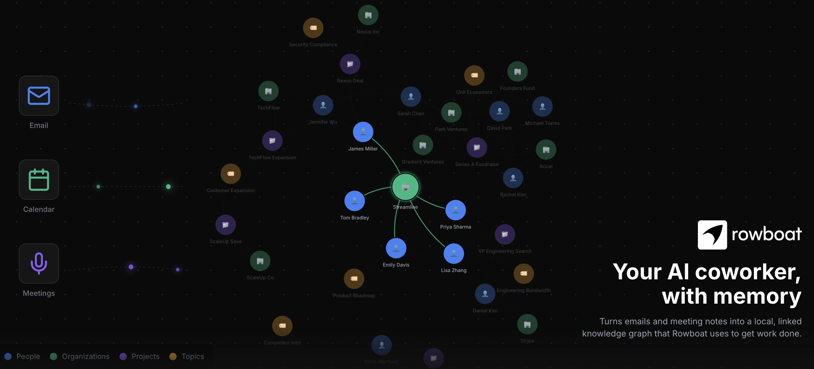
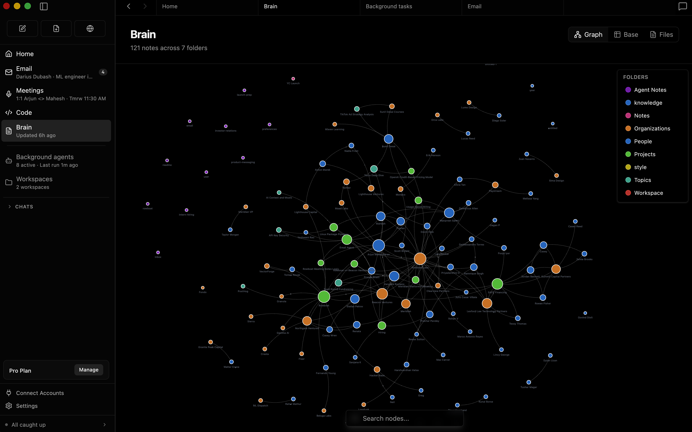
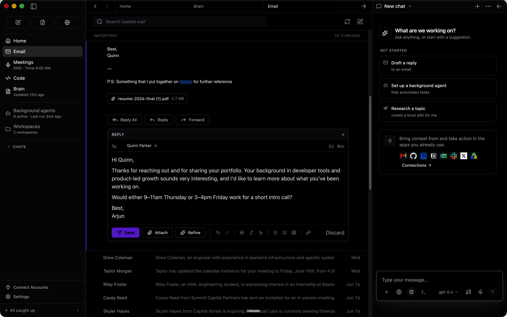
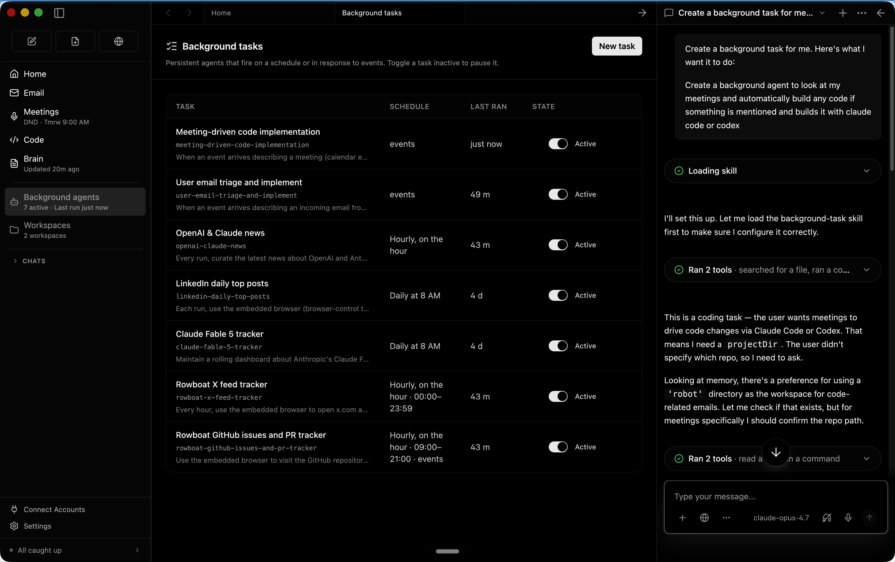
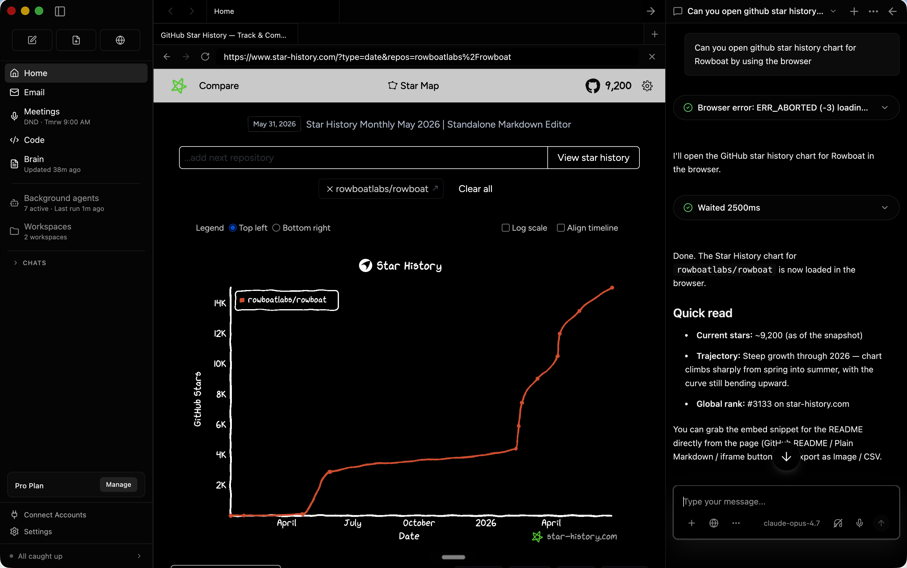
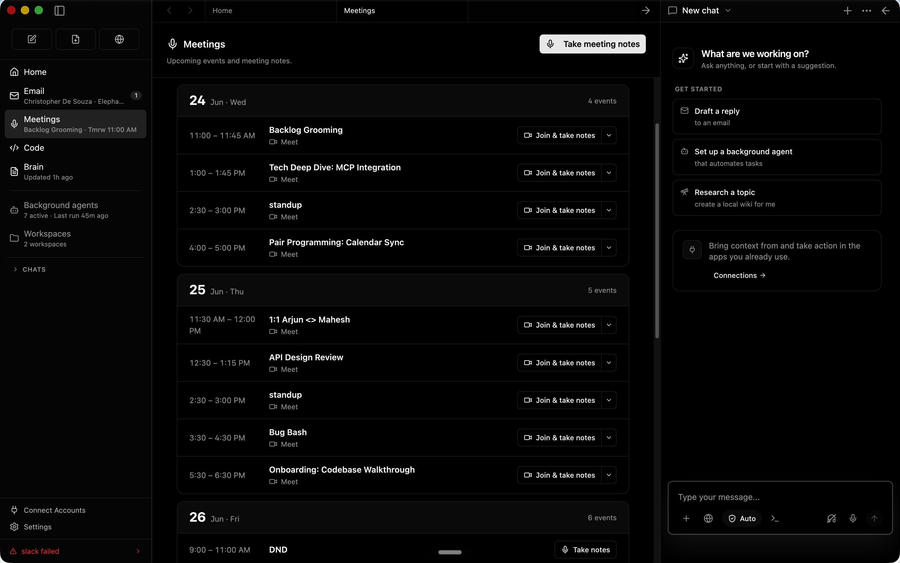
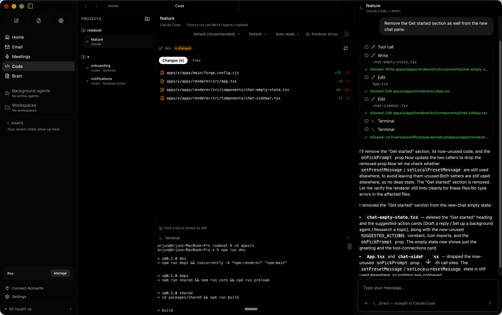
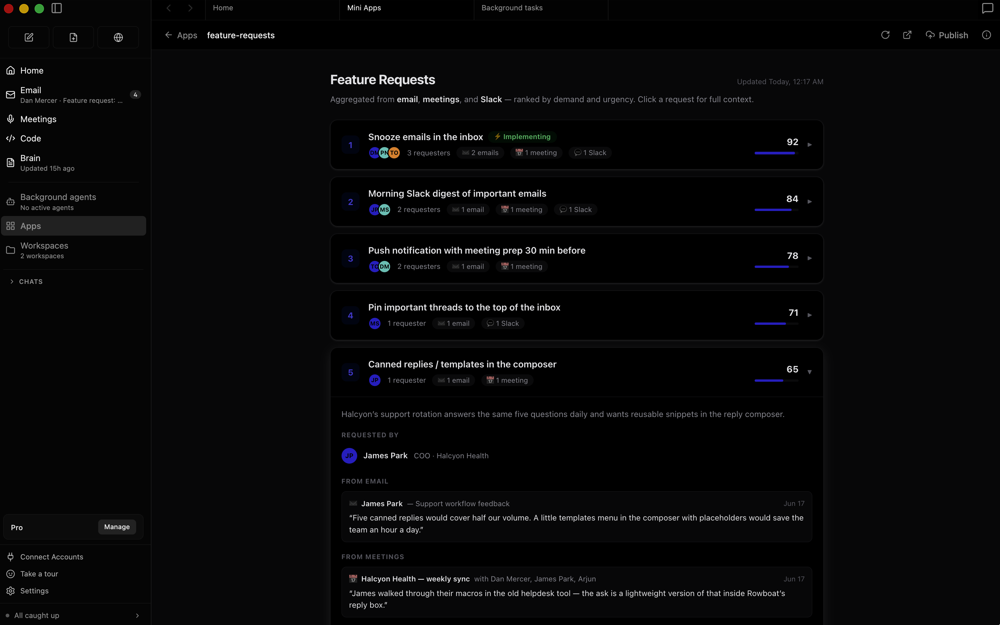
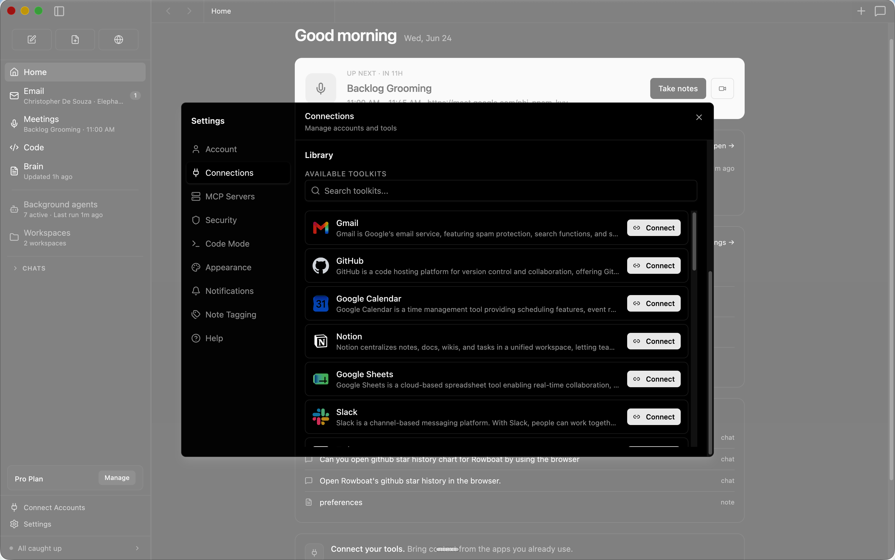

<a href="https://www.youtube.com/watch?v=5AWoGo-L16I" target="_blank" rel="noopener noreferrer">
  
</a>

<h5 align="center">

<h1 align="center">Rowboat</h1>
<p align="center">A desktop AI coworker with a memory of your work and built-in surfaces to act on it.</p>

<p align="center" style="display: flex; justify-content: center; gap: 20px; align-items: center;">
  <a href="https://trendshift.io/repositories/13609" target="blank">
    
  </a>
</p>

<p align="center">
    <a href="https://www.rowboatlabs.com/" target="_blank" rel="noopener">
    
  </a>
  <a href="https://discord.gg/wajrgmJQ6b" target="_blank" rel="noopener">
    
  </a>
  <a href="https://x.com/intent/user?screen_name=rowboatlabshq" target="_blank" rel="noopener">
    
  </a>
  <a href="https://www.ycombinator.com" target="_blank" rel="noopener">
    
  </a>
</p>

</h5>

Rowboat indexes your work into a living knowledge graph and uses that to get work done on your machine. It includes work surfaces for collaborating with AI: email client, notes, browser, code mode, meeting note taker, and workspaces for different projects. 


Download latest for Mac/Windows/Linux: [Download](https://www.rowboatlabs.com/downloads)

<p align="center">
<a href="https://www.youtube.com/watch?v=et5yQABJ3xI">

</a>
</p>

<p align="center">
  <a href="https://www.youtube.com/watch?v=et5yQABJ3xI"> Demo - apps to code </a> · <a href="https://www.youtube.com/watch?v=7xTpciZCfpw"> Demo - knowledge graph</a>
</p>


⭐ If you find Rowboat useful, please star the repo. It helps more people find it.

---
## Overview

<table>
<tr>
<td width="40%" valign="middle">
<h3>Brain</h3>
Rowboat indexes email, meetings, slack and assistant conversations into a living Obsidian-style backlinked knowledge graph. 
</td>
<td width="60%">

</td>
</tr>
<tr>
<td width="40%" valign="middle">
<h3>Email</h3>
The built-in email client sorts emails into important and everything else. Rowboat automatically drafts responses for important email using all the work context.
</td>
<td width="60%">

</td>
</tr>
<tr>
<td width="40%" valign="middle">
<h3>Background agents</h3>
You can set up background agents that run on events like new email or on schedule like every day at 8am. They can connect to tools, search the web, use the browser and write code using Claude Code or Codex.  
</td>
<td width="60%">


</td>
</tr>
<tr>
<td width="40%" valign="middle">
<h3>Built-in Browser</h3>
Rowboat includes a browser that lets you and assistant collaborate on web tasks. Because its isolated from your main browser, you can log in only to the accounts that want the assistant to access. 
</td>
<td width="60%">

</td>
</tr>
<tr>
<td width="40%" valign="middle">
<h3>Meeting Notes</h3>
A local meeting note-taker that taps into mic & speaker, produces live transcript and summarizes the meeting in a markdown file and updates the knowledge graph. 
</td>
<td width="60%">

</td>
</tr>
<tr>
<td width="40%" valign="middle">
<h3>Code Mode</h3>
Code mode lets you spin up parallel coding agents with Claude Code or Codex, and have Rowboat drive them with all the work context where needed.
</td>
<td width="60%">

</td>
</tr>
<tr>
<td width="40%" valign="middle">
<h3>Apps</h3>
You can bulild your own work surfaces inside Rowboat — they get acess to all the tools and integrations, and you can share them with other people.  
</td>
<td width="60%">

</td>
</tr>
<tr>
<td width="40%" valign="middle">
<h3>Integrations</h3>
Includes one-click integrations to most popular products. 
</td>
<td width="60%">

</td>
</tr>

</table>

---

## Installation

**Download latest for Mac/Windows/Linux:** [Download](https://www.rowboatlabs.com/downloads)

**All release files:**   https://github.com/rowboatlabs/rowboat/releases/latest

### Google setup
To connect Google services (Gmail, Calendar, and Drive), follow [Google setup](https://github.com/rowboatlabs/rowboat/blob/main/google-setup.md).

### Voice input
To enable voice input and voice notes (optional), add a Deepgram API key in `~/.rowboat/config/deepgram.json`

### Voice output

To enable voice output (optional), add an ElevenLabs API key in `~/.rowboat/config/elevenlabs.json`

### Web search

To use Exa research search (optional), add the Exa API key in `~/.rowboat/config/exa-search.json`

### External tools

To enable external tools (optional), you can add any MCP server or use Composio tools by adding an API key in `~/.rowboat/config/composio.json`

All API key files use the same format:
```
{
  "apiKey": "<key>"
}
```


## How it’s different

Most AI tools reconstruct context on demand by searching transcripts or documents.

Rowboat maintains **long-lived knowledge** instead:
- context accumulates over time
- relationships are explicit and inspectable
- notes are editable by you, not hidden inside a model
- everything lives on your machine as plain Markdown

The result is memory that compounds, rather than retrieval that starts cold every time.

## Bring your own model

Rowboat works with the model setup you prefer:
- **Local models** via Ollama or LM Studio
- **Hosted models** (bring your own API key/provider)
- Swap models anytime — your data stays in your local Markdown vault

## Extend Rowboat with tools (MCP)

Rowboat can connect to external tools and services via **Model Context Protocol (MCP)**.
That means you can plug in (for example) search, databases, CRMs, support tools, and automations - or your own internal tools.

Examples: Exa (web search), Twitter/X, ElevenLabs (voice), Slack, Linear/Jira, GitHub, and more.

## Local-first by design

- All data is stored locally as plain Markdown
- No proprietary formats or hosted lock-in
- You can inspect, edit, back up, or delete everything at any time

---
<div align="center">

[Discord](https://discord.gg/wajrgmJQ6b) · [Twitter](https://x.com/intent/user?screen_name=rowboatlabshq)
</div>
